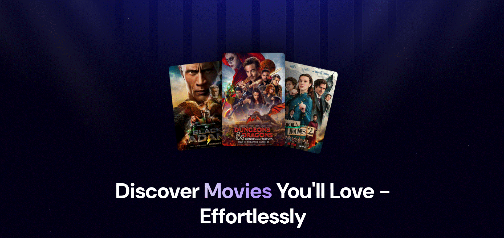
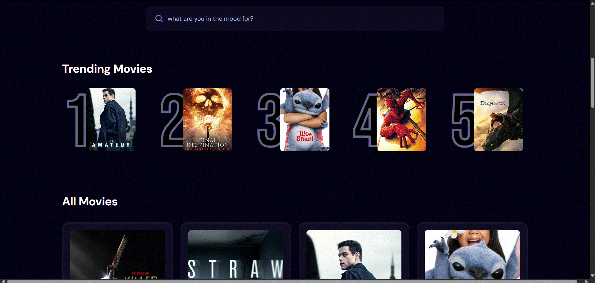
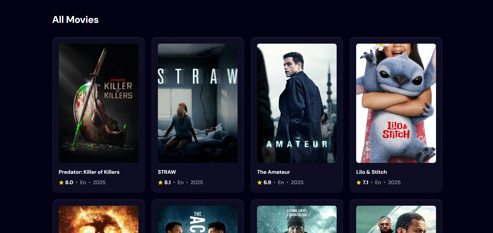

# Movie Maze

MovieMaze is a web app that showcases the **top trending movies** based on what people are searching most often. 

---
## Screenshots

---
## Features

- Fetches top trending movies via **TMDb API**
- Tracks movie searches using **Appwrite**
- Fast and dynamic UI using **React + Tailwind CSS**
- Fully responsive for desktop and mobile
- Debounced search input for optimized API calls

---

## Built With

| Tech         | Role                        |
|--------------|-----------------------------|
| ReactJS      | Frontend framework          |
| Tailwind CSS | Styling and responsiveness  |
| Appwrite     | Backend for search logging  |
| TMDb API     | Movie data source           |
| React Hooks  | For component lifecycle and state |

---

---

## Acknowledgements

This project is inspired by the [React.js 19 tutorial by JavascriptMastery](https://youtu.be/dCLhUialKPQ?si=cv0Y78_c-5hEdAzu).

All rights and original credit go to the creator of the tutorial. This project was built for learning purposes and to practice React concepts like component structure, hooks, and API integration.

